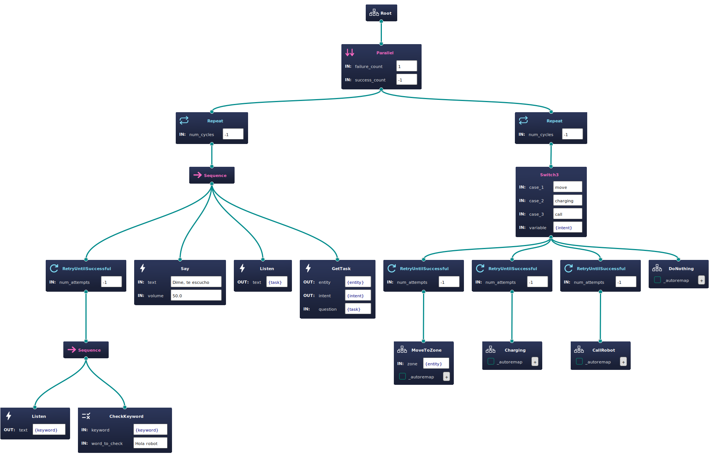

# wasp_dsr_planner

[](https://opensource.org/licenses/Apache-2.0)
[](https://github.com/grupo-avispa/wasp_dsr_planner/actions/workflows/build.yml)


The `wasp_dsr_planner` is responsible for loading and executing a Behavior Tree (BT) in which different use cases are executed. 


## Installation

### Building from Source

#### Dependencies

- [Cortex](https://github.com/grupo-avispa/cortex) (Library for Deep State Representation)
- [BehaviorTree.CPP](https://www.behaviortree.dev) (Behavior Tree library)

#### Building

To build from source, clone the latest version from this repository and compile the package using the following command:

```bash
mkdir build
cd build
cmake ..
make
sudo make install
```

## Usage

First, you must add the following lines to your .bashrc file:

```bash
export PATH=/opt/wasp/bin:$PATH
export LD_LIBRARY_PATH=/opt/wasp/lib:$LD_LIBRARY_PATH
```

Then, you can run the `wasp_dsr_planner` package using the following command:

```bash
wasp_dsr_planner /opt/wasp/wasp_dsr_planner/params/default.conf
```

## Example



## BT Nodes

This package contains the following BT nodes:

## Action Nodes
 * `cancel_action`: Cancels the current action.
 * `dock`: Docks the robot ro a charging station.
 * `generate_response`: Generates a response using LLM.
 * `get_alarm`: Gets an alarm.
 * `get_intent`: Gets the intent of the person.
 * `get_random_goal`: Gets a random goal from a zone.
 * `get_role`: Gets the role of the person.
 * `get_task`: Gets the task of the robot.
 * `help`: Add an alarm.
 * `insert_node`: Inserts a node in the DSR.
 * `interaction`: Set the person as interacting.
 * `listen`: Listens to the person.
 * `move`: Moves the robot to a specific goal.
 * `play`: Plays a sound.
 * `say`: Speaks a sentence or phrase.
 * `set_volume`: Sets the volume level.
 * `show`: Shows an image on the screen.
 * `sign`: Launch the sign language interpreter.
 * `use_case_selector`: Selects a specific use case.
 * `wait_menu_selection`: Waits for a menu selection.

## Condition Nodes
 * `can_track_person`: Checks if the agent can track a person.
 * `check_keyword`: Checks if a word match with the keyword decided.
 * `is_button_pushed`: Checks if a button is pushed.
 * `is_navigating`: Checks if the agent is currently navigating.
 * `person_found`: Checks if a person has been found.
 * `reset_person_id`: Resets the ID of the tracked person.
 * `safe_interaction`: Checks if the person is at a safe distance.
 * `use_case_finished`: Checks if the current use case has finished.

## Control Nodes
 * `recovery_node`: Performs a recovery action.

## Decorator Nodes
 * `distance_approach`: Approaches a target location based on distance.
 * `get_causes`: Gets the causes of a specific use case.
 * `sentence_builder`: Builds a sentence based on current use case and the person.
